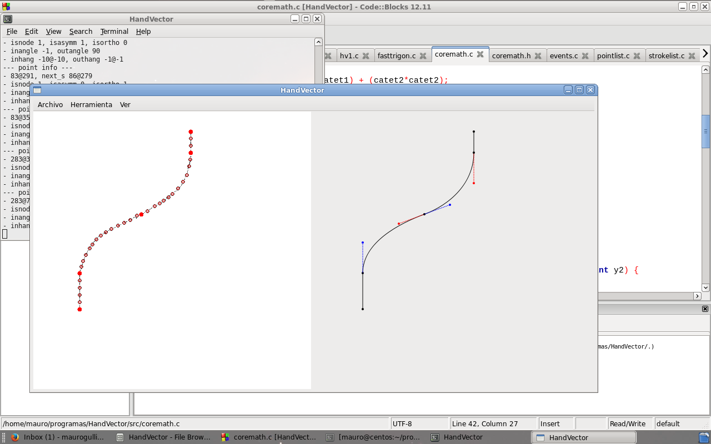
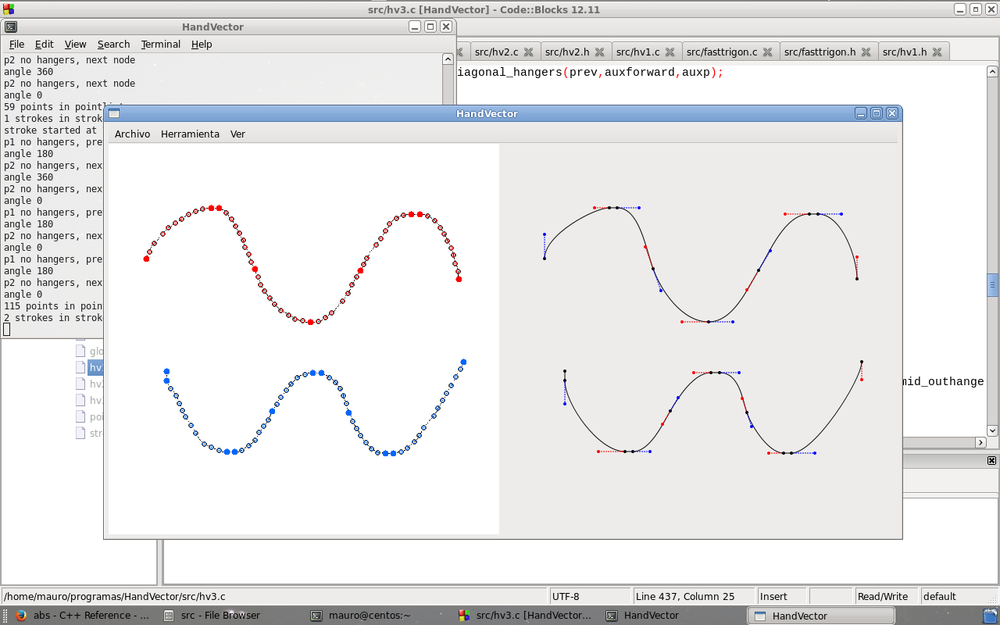
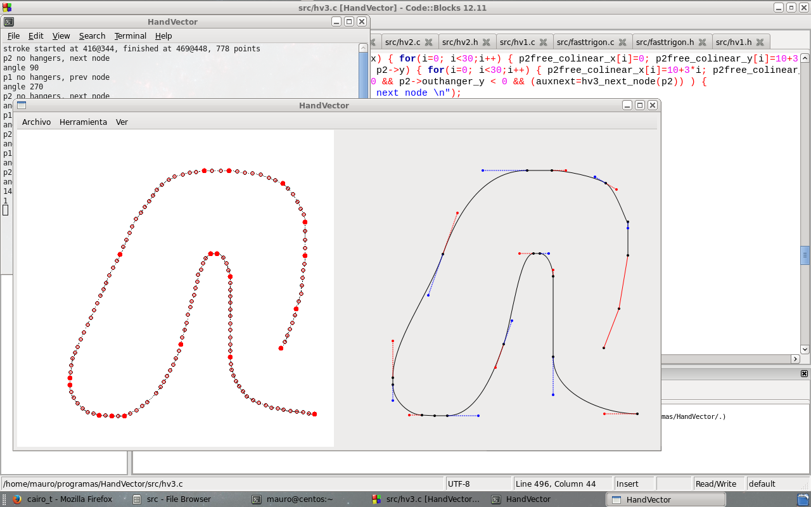
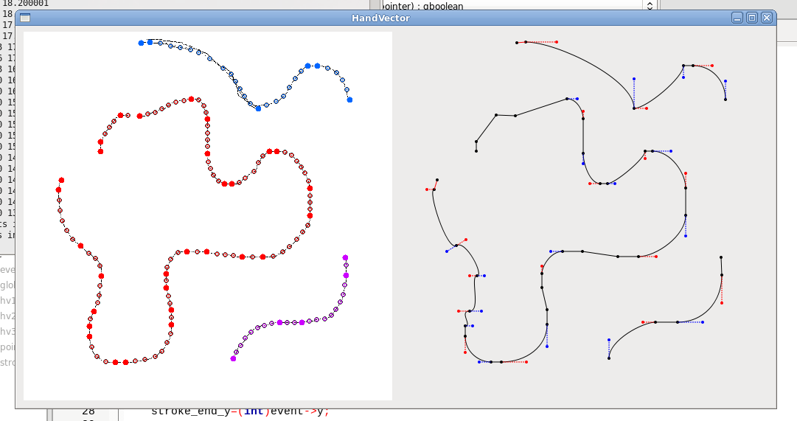

# handvector

With this tool I try to find Bézier curves from hand written strokes, i.e. "vectorize".
This program is supposed to be used with a drawing tablet (Wacom...).

At the time of this development I was studying typography (typeface) design. Initial paper drawings are key to this design process.

Bézier curves used in typefaces should follow certain criteria in order to be later rasterized on a screen properly. This program implement those rules.

## Design

The algorithm works in three steps:
1. Extract points from a raw drawing (bitmap) on a canvas
2. Discover paths from step 1 points-list
3. Discover nodes from step 2 strokes-list and proceed to estimate Béziers

## Techologies

ANSI C language, GTK and Cairo libraries for GUI.

There is a lot of trigonometry and geometry calculation.

## Demo

